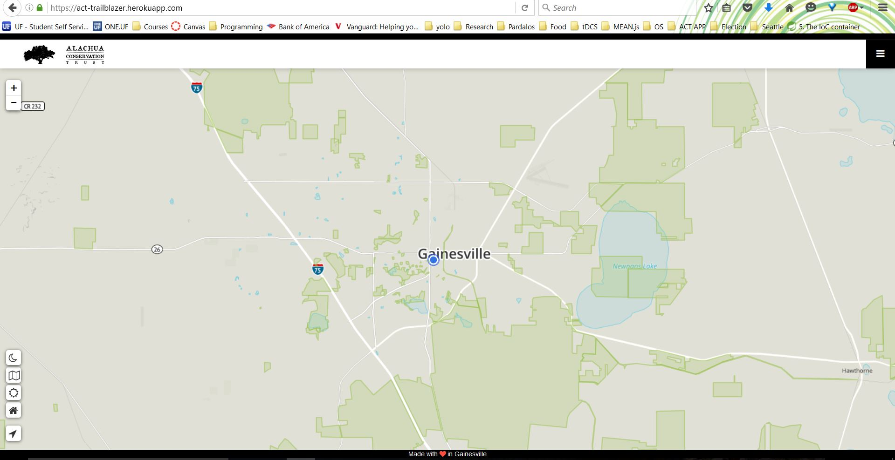
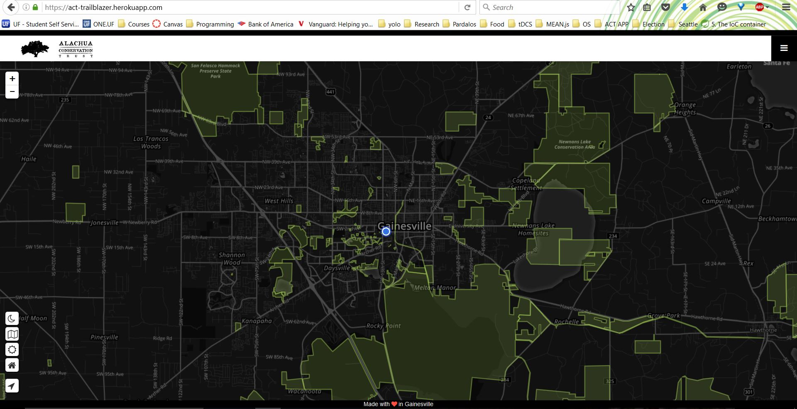
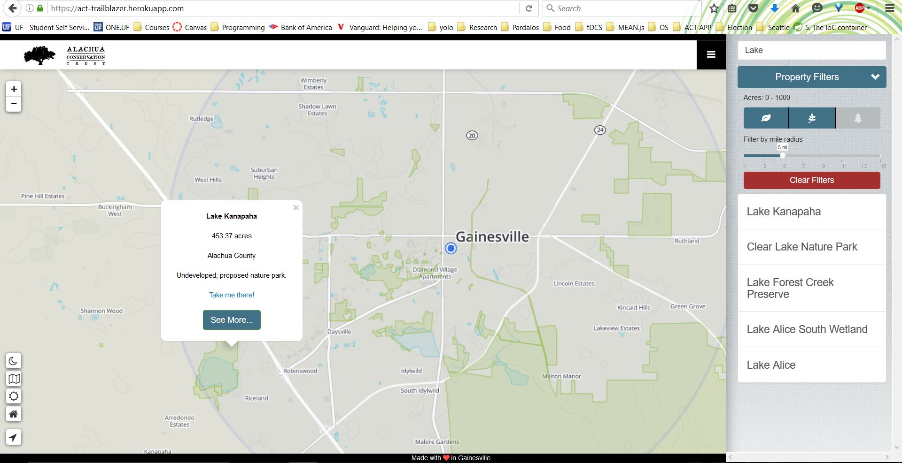
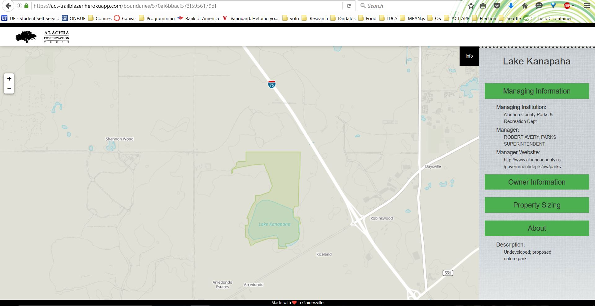
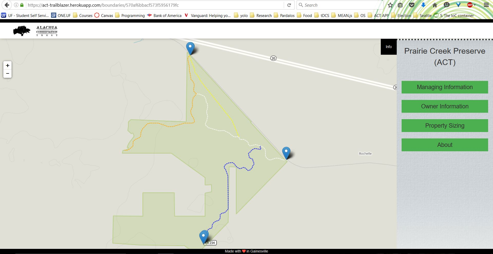

# Trailblazer

## Local Install

To get the app running on your local machine, you first need to install all prerequisites found [here](https://github.com/MEAN-Girls/Trailblazer/tree/develop/app). Once you have done that, you can clone this repository.

From the **app directory** do the following:

1.Install all of your packages and libraries by running:
```bash
$ npm install
$ bower install
```
2.Set your MONGOLAB_URI environment variable to your mongolabs uri. **DO NOT** hardcode any config files, set this via your OS.

3.You can now run your application by running:
```bash
$ grunt
```


##Students


Name   		      |  Gatorlink     | Role   
------------------|----------------|-----------------
Duica, Cristian   | crisd0000	   |
Jeffords, Cameron | camj           |
Mejia, Krystal    | krystalmejia24 | Scrum Master
Wickes, Takashi   | twickes32	   | Product Manager


## Credits
[Leaflet](http://leafletjs.com/)

[Angular-Leaflet-Directive](http://tombatossals.github.io/angular-leaflet-directive/#!/)

[Mapbox](https://www.mapbox.com/mapbox.js/api/v2.4.0/)

[Angular-Bootstrap](https://angular-ui.github.io/bootstrap/)

[Angular-Awesome-Slider](http://darul75.github.io/angular-awesome-slider/)

## License
(The MIT License)

Permission is hereby granted, free of charge, to any person obtaining
a copy of this software and associated documentation files (the
'Software'), to deal in the Software without restriction, including
without limitation the rights to use, copy, modify, merge, publish,
distribute, sublicense, and/or sell copies of the Software, and to
permit persons to whom the Software is furnished to do so, subject to
the following conditions:

The above copyright notice and this permission notice shall be
included in all copies or substantial portions of the Software.

THE SOFTWARE IS PROVIDED 'AS IS', WITHOUT WARRANTY OF ANY KIND,
EXPRESS OR IMPLIED, INCLUDING BUT NOT LIMITED TO THE WARRANTIES OF
MERCHANTABILITY, FITNESS FOR A PARTICULAR PURPOSE AND NONINFRINGEMENT.
IN NO EVENT SHALL THE AUTHORS OR COPYRIGHT HOLDERS BE LIABLE FOR ANY
CLAIM, DAMAGES OR OTHER LIABILITY, WHETHER IN AN ACTION OF CONTRACT,
TORT OR OTHERWISE, ARISING FROM, OUT OF OR IN CONNECTION WITH THE
SOFTWARE OR THE USE OR OTHER DEALINGS IN THE SOFTWARE.







