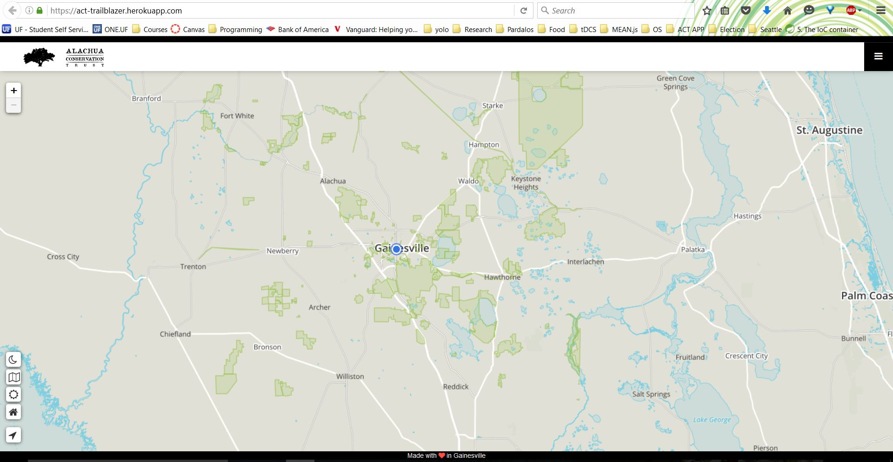
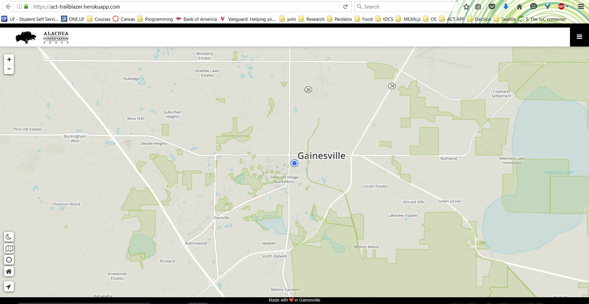

# Trailblazer

## Implemented Functionality

### Landing Page

The landing page is the central part of this application. Here is where users can explore Alachua county on our interactive map, and view all properties relative to their current location. Our base map layer can be swapped between three separate views (daytime, nighttime, and satellite). There are also 'home' and 'locate' buttons under these view buttons. The home button zooms all the way out to show the entire Alachua county area. The locate button finds the users location and zooms and pans to it. Shown below are pictures demonstrating some of these features:

#### Map Tiles

###### Daytime view, after clicking the home button:


###### Daytime view, after clicking the locate button:


###### Nighttime view:
 

#### Boundary Properties

Each one of the boundaries on the landing page is clickable, which initiates a popup with the name and a short description of the property, as well as a “take me there!” button that gives directions to the property in google maps, or the relevant mapping application. The landing page sidebar houses a list of all properties, and a dropdown containing multiple filtering options. The search bar searches the property list by name. The acres filter allows the user to filter the properties based off of preset sizes. The radius slider allows the user to specify a certain radius in miles away from their current location. This places a circle on the map with said radius, and shows in the sidebar only the properties contained within this circle. All filters are compoundable. These features are displayed in the below image:

#### Filters


If the user clicks the “see more” button on a boundary popup, it will redirect them to the boundary page for that specific property. The boundary page focuses in on the clicked property, and has an info bar that contains relevant information about the property itself. This is shown in the following screenshot.

### Boundary Page


#### Trail View 

Many properties contain trails. If this is the case, the trails will appear in the boundary view. They are color coded to match the physical color of the trail markers. The trail head can be clicked, as well as the trail parking, and contains a “take me there!” option as well.


## Local Install

To get the app running on your local machine, you first need to install all prerequisites found [here](https://github.com/MEAN-Girls/Trailblazer/tree/develop/app). Once you have done that, you can clone this repository.

From the **app directory** do the following:

1.Install all of your packages and libraries by running:
```bash
$ npm install
$ bower install
```
2.Set your MONGOLAB_URI environment variable to your mongolabs uri. **DO NOT** hardcode any config files, set this via your OS.

3.You can now run your application by running:
```bash
$ grunt
```


##Students


Name   		      |  Gatorlink     | Role   
------------------|----------------|-----------------
Duica, Cristian   | crisd0000	   |
Jeffords, Cameron | camj           |
Mejia, Krystal    | krystalmejia24 | Scrum Master
Wickes, Takashi   | twickes32	   | Product Manager


## Credits
[Leaflet](http://leafletjs.com/)

[Angular-Leaflet-Directive](http://tombatossals.github.io/angular-leaflet-directive/#!/)

[Mapbox](https://www.mapbox.com/mapbox.js/api/v2.4.0/)

[Angular-Bootstrap](https://angular-ui.github.io/bootstrap/)

[Angular-Awesome-Slider](http://darul75.github.io/angular-awesome-slider/)

## License
(The MIT License)

Permission is hereby granted, free of charge, to any person obtaining
a copy of this software and associated documentation files (the
'Software'), to deal in the Software without restriction, including
without limitation the rights to use, copy, modify, merge, publish,
distribute, sublicense, and/or sell copies of the Software, and to
permit persons to whom the Software is furnished to do so, subject to
the following conditions:

The above copyright notice and this permission notice shall be
included in all copies or substantial portions of the Software.

THE SOFTWARE IS PROVIDED 'AS IS', WITHOUT WARRANTY OF ANY KIND,
EXPRESS OR IMPLIED, INCLUDING BUT NOT LIMITED TO THE WARRANTIES OF
MERCHANTABILITY, FITNESS FOR A PARTICULAR PURPOSE AND NONINFRINGEMENT.
IN NO EVENT SHALL THE AUTHORS OR COPYRIGHT HOLDERS BE LIABLE FOR ANY
CLAIM, DAMAGES OR OTHER LIABILITY, WHETHER IN AN ACTION OF CONTRACT,
TORT OR OTHERWISE, ARISING FROM, OUT OF OR IN CONNECTION WITH THE
SOFTWARE OR THE USE OR OTHER DEALINGS IN THE SOFTWARE.

